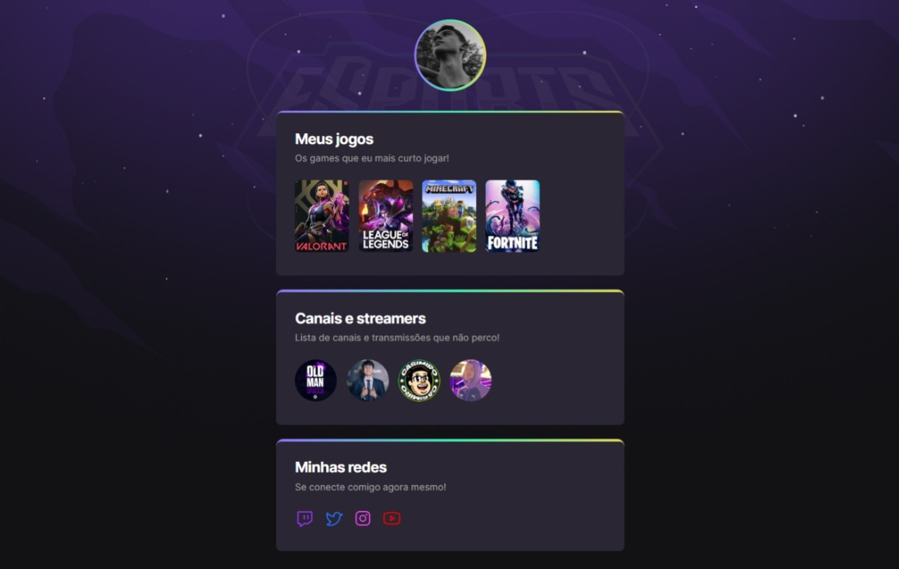

# README

Landing page com tema de E-sports feito por [João Pedro Monção](https://github.com/jpmoncao) durante a Maratona Explorer da Rocketseat, com HTML e CSS.

##

## 🚀Demo

## ⏩Executando

[Execute a landing page clicando aqui!](https://jpmoncao.github.io/nlw-explorer/)

## 🎈Desafio extra
Recomendo dar uma olhada em um projeto semelhante da maratona! Feito como desafio extra.
 - [Landing page tema de filmes e séries](https://github.com/jpmoncao/nlw-esports-extra) 

## ✔️Melhorias
Sistema CRUD de contas via github, mais interatividade e etc

## 💻Stack utilizada
**Front-end:** HTML e CSS

## 🛠 Habilidades
HTML
- Semântica
- Listas
- Divs
- Classes
- Metadados
- Links

CSS
- Layouts
- Manipulação do background
- Animações
- Box model
- Displays

## 📖Referência

 - [Rocketseat](https://www.rocketseat.com.br/) 
 
## 🚹 Sobre mim
Eu sou João Pedro Monção, tenho 16 anos e atualmente estou cursando técnico em Informática. Estou estudando Front-end! Espero que curta o projeto deste repositório e aproveite para conferir meu perfil...

## 🔗 Links

## 📞Suporte

Para suporte, mande um email para pedrohjoao44@gmail.com

##

Índice

  <a href="## 🚀Demo">🚀Demo, </a><a href="## ⏩Executando">⏩Executando, </a><a href="## ✔️Melhorias">✔️Melhorias, </a><a href="## 💻Stack utilizada">💻Stack utilizada, </a><a href="## 🛠 Habilidades">🛠 Habilidades, </a><a href="## 📖Referência">📖Referência, </a><a href="## 🚹 Sobre mim">🚹 Sobre mim, </a><a href="## 🔗 Links">🔗Links e </a><a href="## 📞Suporte">📞Suporte </a>

##

🚧Projeto finalizado - aberto a melhorias🚧

